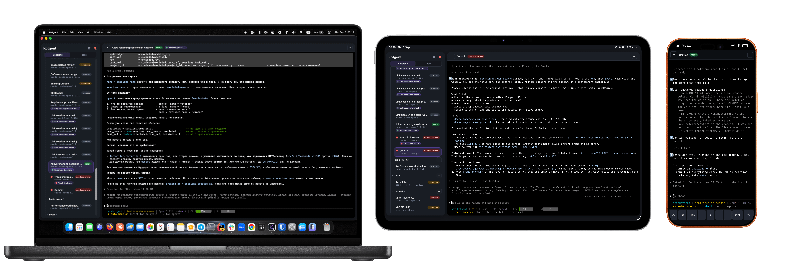

# kotgent

[](https://github.com/Heapy/kotgent/actions/workflows/ci.yml)
[](LICENSE)

## What kotgent is

**kotgent** is a local-first control plane for running Claude, Codex, Junie, or a login shell inside
`tmux` and supervising those sessions from a terminal, a desktop browser, or an installed PWA.

It is for developers who want long-running coding work to continue after the IDE or browser closes, and
who want to move between Mac, iPad, and iPhone without moving the process itself. Kotgent provides:

- durable agent processes in an isolated `tmux` server;
- one live session list and terminal shared by every client;
- attention notifications when an agent needs a human response, plus early weekly quota-reset notices;
- shared Claude and Codex usage meters in the sidebar;
- restart-safe session state and a project task backlog stored locally on the Mac.

Kotgent does not replace a provider's conversation storage. Claude, Codex, and Junie still own their
transcripts and resume behavior; kotgent records enough state to reconnect the right process and client.



There are two distinct kinds of durability, and kotgent leans on both instead of trying to make `tmux`
immortal:

- **Close the IDE / reload the browser** — the agent keeps running in `tmux` (a client detached, the
  process did not die).
- **Reboot the machine** — the process is gone, but the conversation is preserved on disk by the provider
  itself and is restored with `resume`. See the [agent guides](#agents) for recovery behavior and limits.

## Contents

- [What kotgent is](#what-kotgent-is)
- [Install with Homebrew](#install-with-homebrew)
- [Cloudflare Tunnel](#cloudflare-tunnel)
- [Install the PWA in Safari](#install-the-pwa-in-safari)
- [Architecture](#architecture)
- [Requirements](#requirements)
- [Agents](#agents)
- [Build & test](#build--test)
- [The CLI](#the-cli) — [the task backlog](#the-task-backlog),
  [access & auth](#access--auth--two-keys-one-shape), [Web UI](#web-ui--kotgent-web)
- [Troubleshooting](#troubleshooting)
- [How a session stays available](#how-a-session-stays-available)
- [Status & limitations](#status--limitations)
- [Contributing](#contributing)
- [License](#license)

## Install with Homebrew

Kotgent supports macOS on Apple Silicon. Install it from the Homebrew tap; the formula also installs
`tmux`:

```shell
brew install Heapy/tap/kotgent
```

Run the setup from a normal login shell. `kotgent install` creates and starts a per-user launchd agent,
capturing that shell's `PATH` and UTF-8 locale. Start a plain shell for the provider-free first run, then
open the Web UI:

```shell
kotgent install
kotgent start shell
kotgent web
```

To run a coding agent instead, its CLI must already be on that login shell's `PATH`:

```shell
kotgent start claude       # or: codex, junie
```

`kotgent list` shows every session and its state. `kotgent attach <id>` opens its terminal, and closing a
terminal or browser only detaches that client—the process keeps running in `tmux`.

Upgrades are `brew upgrade kotgent`, followed by **`kotgent install` again**: the plist records the
binary's real (version-qualified) Cellar path, which a new release invalidates.

To build from source instead, see [Build & test](#build--test).

## Cloudflare Tunnel

Remote browser and PWA access is optional. The native daemon deliberately binds only to
`127.0.0.1:27508` and does not terminate TLS, so **never publish that port directly**. Use a named
[Cloudflare Tunnel](https://developers.cloudflare.com/tunnel/setup/) with a
[Cloudflare Access](https://developers.cloudflare.com/cloudflare-one/setup/secure-private-apps/private-web-app/)
policy in front of it. This boundary matters: the Web UI exposes a terminal that can run arbitrary
commands on the Mac.

1. Put a domain on Cloudflare and install [`cloudflared`](https://developers.cloudflare.com/tunnel/downloads/)
   on the Mac:

   ```shell
   brew install cloudflared
   ```

2. In **Cloudflare Dashboard → Networking → Tunnels**, create a named tunnel. Use the macOS connector
   command shown by the dashboard so `cloudflared` runs as a service, then add one **Published
   application** route:

   | Setting | Value |
   |---|---|
   | Public hostname | `kotgent.example.com` |
   | Service | `http://127.0.0.1:27508` |

3. In **Zero Trust → Access controls → Applications**, protect that exact hostname with a self-hosted
   application and an Allow policy restricted to your identity. Do not use an `Everyone` or `Bypass`
   policy.

4. Tell kotgent which public origin it may accept, then restart the daemon so the allowlist takes effect:

   ```shell
   kotgent config set public-url https://kotgent.example.com
   launchctl kickstart -k "gui/$(id -u)/io.kotgent.daemon"
   ```

Use your own hostname in both places. A stable named tunnel is required; a temporary `trycloudflare.com`
URL cannot be configured as the durable PWA origin. Only the browser surface crosses the tunnel—CLI and
provider-hook credentials remain loopback-only. Finally, open the public hostname in a private Safari
window and verify that Cloudflare Access appears **before** kotgent's sign-in form; if it does not, fix the
Access policy before installing the PWA.

## Install the PWA in Safari

Open Kotgent in Safari before installing it:

- on the host Mac, use `http://127.0.0.1:27508/auth`;
- on another Mac, an iPad, or an iPhone, use `https://kotgent.example.com/auth` and complete Cloudflare
  Access first.

Install the app **before** redeeming a kotgent sign-in code. Safari and an installed web app have separate
cookie storage, so a login completed in the browser does not reliably sign in the installed app.

### macOS

Safari web apps require macOS Sonoma 14 or later. In Safari, choose **File → Add to Dock** (or
**Share → Add to Dock**), choose the name, and click **Add**. Launch Kotgent from the Dock or Spotlight.
See [Apple's Safari web-app guide](https://support.apple.com/104996).

### iPhone

In Safari, tap **More → Share** (or the Share button, depending on the tab layout), choose
**Add to Home Screen**, enable **Open as Web App**, and tap **Add**. Launch Kotgent from its Home Screen
icon. See [Apple's iPhone guide](https://support.apple.com/guide/iphone/iphea86e5236/ios).

### iPad

In Safari, tap **Share → More → Add to Home Screen**, enable **Open as Web App**, and tap **Add**. Launch
Kotgent from its Home Screen icon. See [Apple's iPad guide](https://support.apple.com/guide/ipad/ipad8f1f7a29/ipados).

After launching the installed app, complete Cloudflare Access again if prompted. Generate a fresh,
single-use kotgent code with `kotgent web`, or with the phone button in an already signed-in desktop Web
UI opened on the host Mac, and type that code into the installed app. On iPhone and iPad, server-sent Web
Push requires iOS or iPadOS 16.4 or later and notifications must be enabled from the installed app.

## Architecture

```text
IDE terminal / CLI ────────────────────────────┐
Local browser / Safari web app ────────────────┼──▶ kotgent daemon ──▶ tmux ──▶ agent | shell
Remote Safari / PWA ─▶ Access ─▶ Tunnel ───────┘          │     │
                                                         │     └──▶ Web Push service
                                                         ├──▶ SQLite event log + task backlog
                                                         └──▶ provider adapters + hooks
```

The daemon is the control plane, while `tmux` owns the live process and each provider owns its
conversation history. Adapters normalize provider-specific hooks into canonical events; a pure reducer
folds the append-only event log into the current session projection. One upstream `tmux attach` per
session is fanned out to every terminal client.

| Layer | Responsibility |
|---|---|
| `core/` | Host-free events, session reducer/projection, quota rules, and notification models. |
| `adapter/` | Claude, Codex, Junie, and shell launch/resume behavior plus event normalization. |
| `daemon/` | Session lifecycle, reconciliation, provider-id capture, and task coordination. |
| `tmux/`, `pty/` | Isolated process hosting and the single-upstream terminal fan-out. |
| `store/`, `task/` | SQLite session/usage history, notification inbox, and project backlog. |
| `transport/` | Ktor REST, WebSocket, authentication, and static PWA endpoints. |
| `push/` | Attention tracking, early-reset inbox projection, subscriptions, VAPID signing, and Web Push delivery. |
| `launchd/` | Per-user daemon installation and environment capture. |

State is local and restart-safe; remote access publishes only the authenticated browser surface. See
[docs/INTENT.md](docs/INTENT.md) for product boundaries, [CLAUDE.md](CLAUDE.md) for architecture
invariants, and [docs/TESTING.md](docs/TESTING.md) for the verification strategy.

## Requirements

- **macOS on Apple Silicon (arm64).** The build targets `macosArm64` and links against macOS system
  libraries; there is no other supported target.
- **Source builds only: JetBrains Kotlin Toolchain** — invoked through the bundled `./kotlin` wrapper
  committed in the repo.
  You do **not** need a separate install or Gradle; the wrapper provisions the toolchain (0.12.1) on
  first run. A JDK is required for the toolchain, for the build-time SQLDelight codegen plugin, and for
  the JVM-side browser tier (`webuitest`), whose first run additionally downloads Playwright's browser
  bundle — see [Build & test](#build--test).
- **`node` (v24 or newer), for `./kotlin test` only.** The browser-independent Web UI tier runs under
  Node's built-in runner (`node --test`) over the shipped ES modules themselves. It is a **test**
  prerequisite, never a runtime or build one: kotgent itself needs no Node, and there is still no
  `package.json`, no bundler and no `node_modules` anywhere in this repository. A missing `node` reddens
  that tier by name rather than skipping it.
- **`tmux`** — sessions live on a dedicated server socket (`tmux -L kotgent`), isolated from your normal
  `tmux` **and from your `~/.tmux.conf`**: kotgent passes `-f /dev/null` on every invocation, so none of
  your config is loaded into an agent's pane — not your prefix key, bindings, plugins, `status-format` or
  `default-terminal`. This is deliberate. A `~/.tmux.conf` is written for a terminal *you* drive, and one
  line of it (`set -g destroy-unattached on`) would kill the agent every time the last viewer detaches.
  In its place kotgent forces its own small set: `destroy-unattached off`, `default-terminal
  tmux-256color`, `mouse on`, `status off`, `history-limit 10000`, `escape-time 10`. `mouse on` is what
  makes the wheel scroll an agent's transcript — that scrollback lives in the tmux pane, so it is the only
  way a browser tab that joined an existing session can see anything above the current screen. kotgent arms
  mouse reporting for every viewer as it joins, but the single upstream uses the last-resizing viewer's
  geometry; only that viewer has a fully live wheel, and a larger tab's lower/right area may not scroll.
  Two other things to know: selecting text in the web terminal needs Option-drag on macOS (Shift-drag
  elsewhere), because a mouse-reporting terminal otherwise sends the drag to the app; and a wheel scroll
  puts the pane into tmux copy-mode, which every viewer shares — kotgent leaves copy-mode before
  programmatic Interrupt/REST input. Interrupt returns only after tmux verifies delivery; REST input
  reports when full PTY write completion was not observed. A PTY error may have written a prefix, so
  inspect the terminal before resending to avoid duplicated input. `focus-events` stays off: with one tmux client
  fanned out to many viewers, "is the terminal focused" has no single answer. Developed against tmux 3.7b.
- **An agent CLI**, installed and available on the login shell's `PATH` when you run `kotgent install`.
  Only the agent you want to use is required; a plain shell needs no additional CLI. See [Agents](#agents).
- **`/usr/bin/openssl` and NSURLSession (Web Push only).** kotgent lazily uses macOS's system
  `/usr/bin/openssl` to generate and sign its VAPID P-256 credential; outbound HTTPS delivery uses
  the Darwin HTTP client backed by NSURLSession and the system trust store. Both are macOS runtime
  facilities, not packages to install. If VAPID setup fails, the daemon and in-tab notifications keep
  working; only server-sent push is unavailable.

## Agents

These user guides describe how each integration currently works: setup, launch, resume and import,
configuration, session status, usage meters, and known limitations.

| Session type | Start command | User guide |
|---|---|---|
| Claude Code | `kotgent start claude` | [Claude Code](docs/agents/CLAUDE.md) |
| Codex | `kotgent start codex` | [Codex](docs/agents/CODEX.md) |
| Junie | `kotgent start junie` | [Junie](docs/agents/JUNIE.md) |
| Login shell | `kotgent start shell` | [Shell](docs/agents/SHELL.md) |

## Build & test

```shell
./kotlin build      # compile the macosArm64 app (+ the sysnative cinterop, + SQLDelight codegen)
./kotlin do kexePath # print the debug app's absolute .kexe path (releaseKexePath for the release one)
./kotlin test       # run the test suite
```

`./kotlin test` runs every tier and the suite has no skips: the native suite (`test/`), the browser tier
(`webuitest/`, a real Chromium driven through Playwright), the browser-independent JavaScript tier
(`webuitest/js/` under `node --test`, spawned by `WebUiLogicTest`), 7 JVM tests for the build-info
plugin, the 11 real-PTY tests under `test/pty/` and the 2 harness self-checks in `webuicheck/test/`. The
two module tasks — `:kotgent:testMacosArm64Debug` and `:webuitest:testJvm` — are the fast local loops;
neither replaces the aggregate. **The counts are deliberately not written here**: they move with every
change, and the run itself is the only source of truth that cannot go stale (`AGENTS.md` carries the
current baseline for the one purpose a number serves — noticing that a change moved it by more than it
meant to).

Run `build` before `test`, for one fixture binary. `./kotlin test` never links a main binary, and every
browser test execs `webuicheck`, so a missing `webuicheck` reddens the whole browser tier — explicitly,
rather than passing quietly. See [Status & limitations](#status--limitations) for why it is a separate
binary at all.

**The first `test` run downloads browsers, and needs the network for it.** Playwright provisions its
browser bundle into `~/Library/Caches/ms-playwright` — measured at about **1.1 GB**, because
`Playwright.create()` installs Chromium, the headless shell, ffmpeg, Firefox and WebKit as one set even
though every test here asks for Chromium and nothing else. There is deliberately no npm anywhere in this
repository: the Node driver ships inside the Maven artifact, so there is no `package.json`, no
`node_modules` and no `npx playwright install` step to run. CI caches that directory under a key that
spells the Playwright version out literally, so bumping `playwright` in `gradle/libs.versions.toml` means
bumping the key in `.github/workflows/ci.yml` in the same commit — otherwise every CI run re-downloads a
bundle it can never save.

The produced binary lands under `build/` (the `macos/app` output). Its directory and filename include
the checkout/worktree name, so use `./kotlin do kexePath` after `build` instead of hard-coding either
(`releaseKexePath` for a `-v release` build); `kotgent` below refers to that binary. The command reads
what `build` left behind rather than triggering it — the toolchain has no way for a plugin task to
depend on the native link — so run it after a successful `build`, or it fails saying so.

It prints the path and also writes it to `build/kexe-path`, which is what a script should read: a task
action's stdout reaches you through the build log, so it is prefixed, interleaved with the log's own
lines, and silenced by `--log-level` before the surrounding noise is. The file follows `--build-dir`
along with everything else, and a failed lookup deletes it rather than leaving a stale answer behind.

```shell
./kotlin build
./kotlin do kexePath
kexe=$(cat build/kexe-path)
```

To install the current checkout as the `kotgent` on your `PATH`, stage its binary and Web UI together,
and restart the launchd agent, use the repository's installer (with `~/.local/bin` on your `PATH`):

```shell
./install-local.sh
```

Pass `--no-daemon` when you want to stage the source build without replacing the running daemon.

## The CLI

```text
kotgent <command> [args]

  daemon [--port N]              run the control-plane server (default port 27508; the launchd entry point)
  install | uninstall           (un)install the launchd LaunchAgent (io.kotgent.daemon)
  start <agent> [cwd]           start a session (agent: 'claude' | 'codex' | 'junie' | 'shell'; cwd defaults to the current dir)
             [--name N] [--tag T] [--task R]
  import <agent> <session-id>   register a session started outside kotgent, then resume it
             [--cwd D] [--name N] [--tag T] [--no-start]
  list | ls                     list sessions and their states
  stop <id>                     stop a session
  resume <id>                   resume a stopped/crashed/resumable session
  interrupt <id>                send Ctrl-C to un-stick a session
  attach <id>                   attach a raw terminal to a session
  session rename <id> <name>    rename a session (an empty name restores the automatic label)

  The task backlog (JSON on stdout — written for an agent to parse). Every subcommand that
  resolves a session takes [--session S] to name it instead of the calling tmux pane.

  task add <title>              create a task            [--body B] [--project P]
  task list                     the project's backlog, in rank order        [--project P]
  task show [<ref>]             one task in full
  task next                     take the next eligible task   [--project P] (exit 3: none)
  task claim <ref>              link this session to a task
  task comment [<ref>] -m TEXT  add a comment ('-m -' reads the text from stdin)
  task review [<ref>] [-m TEXT] move the task to review
  task done [<ref>] [-m TEXT]   close the task and unlink every session holding it
  task unlink [<ref>]           drop this session's link; the task's state is untouched
  task move <ref>               --top | --bottom | --before <ref> | --after <ref>
  task dep add|rm <ref> --on R  add or remove "<ref> depends on R"
  task delete <ref>             remove the task, its dependencies and its feed
  project list                  the live projects, or the deleted ones      [--archived]
  project init [<path>]         write .kotgent.json for a project           [--name N]
  project delete <uuid>         hide a project everywhere; its file, tasks and sessions stay
  project restore <uuid>        bring a deleted project and its backlog back

  web [--print]                 open the Web UI in a browser (or print the login URL)
  token rotate                  re-mint the master token (old key stops authenticating)
  config get | set public-url <url>   read / set the public URL published behind the tunnel
  --version | --help
```

- **`daemon`** binds `127.0.0.1:27508` by default (`27508` = `0x6b74` = ASCII "kt"). Override the
  daemon's listen port with `--port`. The `$KOTGENT_PORT` environment variable does **not** change the
  daemon's port — it tells the CLI *client* (`list`/`start`/`stop`/`attach`/…) which port to reach a
  running daemon on. This is the process launchd runs on login.
- **`install` / `uninstall`** write `~/Library/LaunchAgents/io.kotgent.daemon.plist`
  (`RunAtLoad` + `KeepAlive`, so the daemon comes up on login and is restarted if it dies) and
  `launchctl bootstrap` / `bootout` it. `install` also **snapshots your shell's `PATH` and `LANG`** into
  the plist: launchd starts the daemon with a minimal env and *no* locale, so the snapshot is what lets the
  daemon and the agents it spawns find `claude`/`codex`/`junie` and render a UTF-8 TUI. Re-run it from a full shell
  whenever either goes stale. An agent that can't be resolved on the daemon's `PATH` fails fast with a
  clear error pointing at `kotgent install`, not a silent attach failure.
- **`start`** creates a `tmux` session `kt-<id>`, launches the requested agent or login shell in it, and
  records the session.
- **`import`** brings a conversation you started outside kotgent under its control, with its history
  intact. The import first verifies the provider's on-disk record and registers a `resumable` entry,
  then resumes it in `tmux`; `--no-start` leaves it registered for later. The project directory is
  discovered from the provider's record; pass `--cwd` if discovery fails or picks the wrong directory.
  See the [agent guides](#agents) for finding a provider session id and provider-specific import limits.

  Importing an id kotgent already tracks fails with the existing session's id and the right next move
  (`kotgent resume <id>`, or Restore in the Web UI if that session is archived). The Web UI's new-session
  dialog has a matching **Import** mode, including the register-only checkbox. One caveat: kotgent cannot
  detect that the conversation is still *live* in the original terminal — resuming it there and under
  kotgent at once runs two CLI copies of the same conversation.
- **`attach`** is **not** a direct `tmux attach`. It is a raw-terminal passthrough over the daemon's
  terminal WebSocket (tty put in raw mode via `termios`, stdin → WS, WS → stdout, `SIGWINCH` → resize,
  terminal restored on exit). Detaching an attach only drops a client; the agent stays alive.

### The task backlog

kotgent tracks *sessions*; the backlog tracks *work*. Each project gets an ordered, dependency-aware list
of tasks that you groom on the Web UI's `/tasks` board and an agent inside a session reads from and writes
to. A session's purpose stops being something you remember and becomes something the daemon records — the
sidebar shows which task each session is on, and a task's card shows every session linked to it.

- **A project is a committed file, not a path.** `.kotgent.json` at the checkout root holds a uuid and a
  name, so one backlog survives a `git worktree`, a move, a rename and a clone. It appears the first time a
  task is created somewhere that has no project (or when you run `kotgent project init`), it is written to
  be committed, and **the daemon never commits it for you**. Nothing is written until then — and a
  directory whose project was deleted writes nothing either: `task add` refuses there instead.
- **Deleting a project is a tombstone, not a cascade.** `kotgent project delete <uuid>` (or Delete project
  in the Web UI's command palette) takes the project out of every selector and stops it being a source of
  new work — `task add` and `task next` refuse in its directory, and a `kotgent start` there is left
  unstamped. Everything else is kept exactly as it was: the tasks, their order, their dependencies, their
  comments, and the sessions linked to them. **`.kotgent.json` is never touched**, which is why a delete
  needs no confirmation beyond the dialog and why the directory keeps resolving to that project — delete
  or move the file if you want the directory to stop doing so. `kotgent project restore <uuid>`, or simply
  adopting the directory again with `kotgent project init`, brings everything back; `kotgent project list
  --archived` is how you find the uuid of a checkout that no longer exists.
- **The states are `todo → in_progress → review → done`**, plus a position you drag on the board and
  dependencies that mark a task `blocked` until what it waits on is closed. `kotgent task next` hands out
  the first unblocked `todo` in rank order and exits `3` when there is nothing eligible.
- **The whole `task`/`project` family prints JSON and only JSON** — stdout is the answer, stderr is one
  `{"error":…,"status":…}` object. Inside a kotgent pane the commands need no task id: `kotgent task show`,
  `task comment -m "…"` and `task review -m "…"` resolve the calling pane's own session. Outside one, pass
  `--session <id>`.
- **kotgent does not enforce one worker per task.** You can open a second terminal it never hears about, so
  an exclusive claim would be a guarantee it cannot keep; instead a task may be linked from any number of
  sessions and the board shows all of them. `task next` will not hand the same task to two agents in a row,
  which is the part that actually matters.
- The interface an out-of-repo Agent Skill is written against is [`docs/agent-task-skill.md`](docs/agent-task-skill.md).

### Access & auth — two keys, one shape

The daemon binds `127.0.0.1` only. Two distinct keys guard it:

- **The master token** — the *machine* key. Stored at **`~/.kotgent/token`** (mode `0600`, inside a
  `0700 ~/.kotgent`; generated from 32 bytes of `/dev/urandom`). It authenticates the CLI (as a `Bearer`
  header), the provider hooks (as their own header), and the issuing of browser tickets. `kotgent token
  rotate` re-mints it; the old key stops authenticating **new** requests immediately (already-open
  WebSockets survive until they reconnect, since auth is computed once at handshake).
- **A session cookie** — the *browser* key. A stateless `HttpOnly; SameSite=Strict; Path=/` cookie of the
  form `v1.<issuedAt>.<hmac>` where `hmac = HMAC-SHA256(master-token, "v1|" + issuedAt)`. There is **no
  session table** — the cookie verifies by recomputing the HMAC, so "sign out every device" is just
  `kotgent token rotate` (every HMAC dies at once).

`~/.kotgent` also holds the generated hook settings, the optional `config.json` (public URL), and
`kotgent.db` (including device push subscriptions). Web Push lazily creates the VAPID private key at
`~/.kotgent/vapid.pem` with mode `0600`; deleting or replacing it invalidates existing browser
subscriptions, so notifications must be re-enabled on each device afterwards.

### Web UI — `kotgent web`

```shell
kotgent web            # open the sign-in form and print a code to type into it
kotgent web --print    # print a credentialed login URL for scripting or copying
```

No master token is copied into a URL. `kotgent web` issues one **single-use, 8-character Crockford
Base32 code** (40 bits, held in memory for five minutes), opens the bare
`http://127.0.0.1:<port>/auth` form, and prints the still-valid code. Type it into that browser or an
already-installed PWA. The exchange is protected by a daemon-wide rolling budget of ten failed attempts
per minute in addition to the short lifetime and single-use rule.

`kotgent web --print` is the non-interactive form: stdout contains exactly
`http://127.0.0.1:<port>/auth#ticket=…`, while the equivalent grouped code and human hint go to stderr,
so piping the URL remains safe. The fragment and typed code are two representations of the **same**
credential; spending either invalidates the other. A browser opening the fragment reads it locally,
`POST`s it to `/api/v1/auth/exchange`, and then uses `location.replace("/")`, so neither the server's initial
`GET /auth` nor browser history receives the live fragment.

Programmatic auth calls use `/api/v1/auth/{ticket,exchange,rotate}`. The former root paths remain aliases for
older clients, just as `/hooks/*` remains an alias for hook scripts generated before hooks moved to
`/api/v1/hooks/*`; newly generated scripts and all bundled clients use the versioned paths.

The UI shows the session list with live state badges and a "Needs attention" queue (fed by the events
WebSocket), and renders a session's terminal with `xterm.js` over the terminal WebSocket (byte rendering,
keyboard input, resize). Its installable PWA layout adds a mobile sidebar drawer, safe-area handling,
terminal sizing from `visualViewport`, and a phone-only row for Esc, Tab, Shift-Tab, arrows, Ctrl, and
Ctrl-C. Terminal taps focus the software keyboard without Safari zooming the helper textarea, and a
terminal socket lost — to the app being backgrounded, or to the daemon restarting under it — is reattached
without a reload: on returning to the app, and on the events socket reconnecting, which is the only signal
that a restarted daemon is back. Each attempt checks daemon liveness under a deadline first; a daemon that
is merely unreachable leaves the attempt available for the next one, while a daemon that answers that this
session is gone ends it rather than retrying forever.

The UI is a small router over four paths: `/` and `/s/{id}` for the session view, and `/tasks` and
`/tasks/{ref}` for the [task backlog](#the-task-backlog)'s kanban board — four columns you drag cards
between on a desktop, one column and a switcher on a phone. Each card shows its blocked marker, its
dependency count and every session linked to it, and every change (a drag, a state move, a link, a
deletion) reaches a second tab over the same events WebSocket without a reload. Sessions carry a badge
linking to their task. For a selected live session with no task yet, `⌘K l` opens a searchable picker of
that session's project's `todo`, `in_progress`, and `review` tasks; choosing one writes the same
non-exclusive link as `kotgent task claim`, so a `todo` starts and another session may still choose the
same task. The command palette opens the board with `⌘K o` and its create form with `⌘K w`. Those bare
paths are deep-linkable and installable, which is why the client-facing API lives under `/api/v1`.

One action changes daemon state at a time, and the palette says so rather than queueing. While a start,
an import, a lifecycle action, a rename, a preferences save, a task link, or a project delete or restore
is in flight, the palette's session commands are disabled and name the flow holding the lock; a form submitted
anyway is refused with *"Another action is still in progress — try again in a moment."* The wait is
bounded by the request timeout (60 s), and a mutation holds the lock through its own follow-up read, so
two links to the same session cannot overwrite each other. Reads that are not part of a mutation — the
board, the project list, the terminal — are never blocked by it.

The sidebar footer identifies the running daemon: local source builds show the release version plus their
embedded short Git hash (for example `0.9.0+81c37fe`), while published Homebrew builds show the release
version alone (`0.9.0`).

The usage strip stays pinned above that footer while sessions and projects scroll. Available quota windows
appear as **progress bars showing usage**, shared across sessions, with a current-time marker relative to
the expected reset. Window labels follow the reported duration. Hover, focus with the keyboard, or tap a
bar to see the percentage used, current time, time remaining, reset time and last observation; missing
windows stay hidden. A provider line dims when its newest observation is more than ten minutes old.

Kotgent captures existing provider output without polling and assumes one account per provider on this
Mac. Observation time describes capture activity and does not guarantee a fresh provider lookup. The
[agent guides](#agents) explain each provider's available windows, capture timing and reset limitations.

A session row also carries an **unread pill** — how many events have arrived since you last looked at that
session. Looking at it clears it: the browser posts the cursor it has displayed, so the count is
**server-side** (it clears on the phone and the desktop together, and a second browser sees it clear with no
reload) and **persistent** (restarting the daemon does not resurrect a cleared badge). Reading a session does
not count as activity, so `kotgent list`'s ordering is unaffected.

The per-device notifications toggle registers `/sw.js` and the browser's Web Push subscription. A
`false → true` attention transition or an early weekly quota reset sends a payload-less push. The service
worker fetches the authenticated `/api/v1/notifications` inbox under a ten-second deadline and shows
current session-attention items plus reset notices from the past hour. Attention notices open or focus
their session; quota notices open Kotgent's main view and name the provider, percentage used before the
reset, and when that value was seen. A failed or stalled fetch still produces a generic Kotgent notice.

Scheduled resets and resets of shorter windows do not notify. Early weekly resets remain recorded in
the local journal and inbox even when push is disabled. If Web Push is unsupported, denied, or
unavailable on the daemon, the live tab falls back to ordinary in-tab **attention** notifications;
usage-reset notices require Web Push.


## Troubleshooting

Most real-world breakage traces back to the daemon's launchd environment, which is minimal by design — so
the first question is almost always "does the plist still match my shell?".

- **`start` fails with `agent '…' not found on the daemon's PATH`.** The daemon's `PATH` is a
  snapshot taken at `kotgent install`, not your live shell's. If an agent CLI moved because of a version
  manager or a new Homebrew prefix, re-run `kotgent install`
  from a full login shell. kotgent fails fast here on purpose: the error names the fix instead of leaving a
  phantom `running` row.
- **The TUI renders as a wall of underscores.** The tmux client decided it may not emit UTF-8, which
  happens when the daemon runs without a UTF-8 `LANG` — again a stale plist. Re-run `kotgent install` from
  a shell where `locale` reports a UTF-8 setting.
- **After `brew upgrade kotgent` the daemon does not come back.** The plist records the binary's
  version-qualified Cellar path, which the upgrade invalidates. Re-run `kotgent install`.
- **The port is bound but nothing answers** (a rebind fails with `EADDRINUSE`, or a client connects and
  then hangs). Current builds close every spawn path against descriptor inheritance, so this should only
  come from a long-lived `tmux` server started by an *older* kotgent, which is still holding the listening
  socket the daemon that spawned it left behind. `tmux -L kotgent kill-server` releases it — note that this
  also stops every agent running under that server.
- **I created a project in the wrong folder.** `kotgent project delete <uuid>` removes it from every
  selector without touching anything it owns (find the uuid with `kotgent project list`). The delete does
  **not** remove `.kotgent.json`, so that directory still resolves to the deleted project: `task add` there
  refuses and names all three ways out — restore it, file elsewhere with `--project`, or delete or move that
  `.kotgent.json` — while `kotgent start` there leaves the session unstamped and says nothing. Committing
  the file and then deleting the row is the one combination that keeps coming back.
  `kotgent project restore <uuid>` undoes the delete with the whole backlog.
- **My tmux settings do nothing inside a kotgent pane.** Expected: kotgent runs every tmux command with
  `-f /dev/null`, so `~/.tmux.conf` is never loaded on its socket (see [Requirements](#requirements) for
  what it forces instead). Your own `tmux` on the default socket is untouched. There is no user-facing
  override — the option set lives in `src/tmux/TmuxOptions.kt`. Note the flag only affects the command
  that *starts* a server: if something else already started one on `-L kotgent`, that server has your
  config until it is restarted (`tmux -L kotgent kill-server`, which also stops every agent on it).
- **I can't select text in the browser terminal / the wheel scrolls tmux instead of my terminal.** Both
  are `mouse on`, which kotgent forces so the wheel reaches the pane's own history (10 000 lines, and the
  only scrollback a newly attached viewer has). To select text while an agent's TUI is running, hold
  Option and drag on macOS, or Shift and drag elsewhere. The wheel puts the pane into tmux copy-mode —
  shared by every viewer of that session — which scrolls back down to the bottom to exit, and kotgent
  cancels it anyway before sending keys, so Interrupt is never swallowed by it.
- **Notifications stay in the open tab instead of reaching the phone.** On iOS, Web Push requires iOS
  16.4 or later and an installed home-screen app; enable it from that app's sidebar so the permission
  prompt runs from the tap itself. A missing/unusable `/usr/bin/openssl`, denied browser permission, or an
  unreachable push service disables only server-sent push, and kotgent falls back to live-tab
  attention notifications.
- **Push stopped after `vapid.pem` was deleted, replaced, or regenerated.** A browser subscription is
  bound to the VAPID public key it was created with. Toggle notifications off and on in each installed
  browser/PWA to register a fresh subscription with the daemon. The key at
  `~/.kotgent/vapid.pem` should remain mode `0600`.
- **Inspecting the daemon itself.** It is a normal LaunchAgent: `launchctl print gui/$UID/io.kotgent.daemon`
  shows its state, and the plist at `~/Library/LaunchAgents/io.kotgent.daemon.plist` shows the exact `PATH`
  and `LANG` that were snapshotted.

### Uninstall

```shell
kotgent uninstall                  # bootout + remove the LaunchAgent plist
tmux -L kotgent kill-server        # stop every agent still living in tmux
rm -rf ~/.kotgent                  # token, config/hooks, SQLite data/subscriptions, VAPID private key
brew uninstall kotgent             # if installed from the tap
```

`kotgent uninstall` only removes the launchd entry — the agents in `tmux` and the state under `~/.kotgent`
outlive it by design, so drop them explicitly if you mean to.

## How a session stays available

Kotgent's core control loop is one end-to-end path:

> **`kotgent start` an agent session → close IDEA (Detach) → open the browser → continue the same
> session → see it flag "needs attention" when the agent reports that it needs a response.**

Concretely:

1. `kotgent start <agent>` launches the selected agent inside `tmux` session `kt-<id>` and records it.
2. Attaching from the IDE terminal and then closing it (Detach) drops one WebSocket subscriber. The
   daemon holds the **single** upstream `tmux attach` client and fans it out, so the agent keeps running
   with no client attached.
3. Running `kotgent web` opens the credential-free sign-in form and prints a one-time code; after signing
   in, clicking the session re-attaches to the very same live process — the browser is just another client
   of the same fan-out.
4. When a provider hook reports that the agent needs a response, the daemon updates its session state,
   and the events WebSocket updates the browser's "Needs attention" queue. The available signals depend
   on the [agent integration](#agents).

## Status & limitations

Kotgent is deliberately focused. The current product boundary is:

**Implemented:**

- **Four launch kinds: Claude, Codex, Junie and Shell.** The three providers run as a TUI in `tmux` and
  Shell uses the same lifecycle and terminal fan-out. State tracking and provider limitations are described
  in the [agent guides](#agents).
- **Two keys, browser-friendly auth.** The daemon still binds `127.0.0.1` only, but browsers authenticate
  with a stateless, no-secret-in-URL session cookie (`kotgent web` mints a one-time ticket), and a phone
  can sign in through a **cloudflared** tunnel + Cloudflare Access. The CLI and hooks keep using the master
  token; `kotgent token rotate` invalidates every cookie at once.
- The full `start → Detach → browser → continue → needs-attention` path, session reconciliation on daemon
  restart (`running` / `stopped` / `crashed` / `resumable` classification), provider-id capture, and
  launchd install.
- **Session metadata & lifecycle polish.** Each session shows its agent CLI version and, best-effort, the
  model it is running; its name is an editable label (`kotgent session rename`, or the palette's rename
  dialog) that reaches every open client live and falls back to the automatic one when cleared; **Done**
  stops an agent and archives it off the sidebar (restorable, history kept); and an opt-in, per-device
  **notification toggle** registers server-sent Web Push for attention edges and early weekly quota
  resets, with live-tab fallback for attention only.
- **Shared usage meters.** The sidebar keeps available Claude and Codex usage bars visible, with expected
  resets and observation freshness without provider polling. Early weekly resets retain their prior
  usage in the local notification inbox, independently of push availability.
- **Installable mobile PWA.** The manifest, root service worker, home-screen icons, responsive drawer,
  visual-viewport terminal sizing, software-keyboard focus handling, special-key toolbar, foreground
  terminal reattachment, and notification deep links are all shipped. The service worker is network-only:
  there is deliberately no offline shell when the local daemon cannot serve useful state.
- **Import of externally started sessions.** `kotgent import` (and the Web UI's Import mode) registers a
  conversation begun in a plain terminal and continues it under kotgent — fan-out, push, and mobile access
  included, with the provider's own on-disk record as the history (see [The CLI](#the-cli)).
- **A browser end-to-end tier.** Web UI behaviour is executed rather than described: `webuitest` drives a
  real Chromium through Playwright against `webuicheck`, a fixture binary that assembles the real daemon
  over the shared doubles in `fakes` and serves a terminal from a real PTY running a deterministic script
  instead of a provider. Each test spawns its own harness on an ephemeral port, signs in through the real
  login form, and leaves nothing behind outside the checkout.
- **A browser-independent JavaScript tier.** The pure Web UI rules — revision merges, link eligibility,
  typeahead selection, readiness transitions — are proven under Node's own `node --test`, in
  `webuitest/js/`, against the shipped modules by relative import. It cost the promised nothing: no build
  step, no package manager, no `node_modules`, and no copy of the code under test. `WebUiLogicTest`
  spawns the runner, so `./kotlin test` remains the single gate.

**Backlog (not built yet):**

- Additional providers, including Cursor; see the [Cursor integration research](docs/cursor-cli-research.md).
- Structured mobile actions such as native approve/deny buttons outside the agent's terminal. Approvals
  remain interactive TUI operations today.
- A **diff viewer** and snapshots.
- **More of the Web UI's pure rules proven without a browser.** `lib/commands.js`, `lib/paths.js` and
  `lib/unicode.js` already import cleanly under Node and are only partly covered by the tier in
  `webuitest/js/`; `lib/qr.js` stays in the browser tier for as long as it is the one `lib/` module with
  a bare specifier (`"qrcode"`), which only the import map resolves.
- **Decomposing the remaining `app.js` flows.** Roughly sixty `useCallback` flows still live in one
  module. Moving state into `state/` and async coordination into `lib/mutation.js` was deliberately kept
  separate from splitting the component itself, which is still open and still not urgent.

**The real-PTY tests.** Kotlin Toolchain 0.12 links our own cinterop into test binaries
([KT-78062](https://youtrack.jetbrains.com/issue/KT-78062) is fixed), so these 11 assertions are ordinary
tests under `test/pty/`, one `@Test` each:

1. a `cat` round-trip through the pty,
2. `resize` (`TIOCSWINSZ`) succeeds,
3. the child's exit code is captured,
4. spawning a nonexistent command throws,
5. the spawned child inherits **only** its tty (the `POSIX_SPAWN_CLOEXEC_DEFAULT` guarantee — an
   inherited listening socket would keep the port bound after the daemon dies),
6. `prepareClose` unblocks a full master write,
7. `close` stops the reader **before** releasing the master descriptor (a freed fd number can be reused
   by another session while a stale reader still runs),
8. concurrent `close` runs teardown exactly once,
9. `tmux attach` runs on the spawned pts,
10. a resize **reaches a running `tmux attach`** (the child gets no controlling terminal, so `Pty.resize`
    must deliver `SIGWINCH` itself — see [CLAUDE.md](CLAUDE.md)),
11. `TerminalBridge` fans out over that real attach.

**`webuicheck` stays a separate binary**, for a different reason: the browser tier is JVM (Playwright
cannot drive Kotlin/Native in-process), so the harness it talks to must be a process of its own. No test
task links a main binary, which is why `./kotlin build` still has to run before `./kotlin test`. Its own
two self-checks now live in `webuicheck/test/`; everything a browser can observe is a named assertion in
`webuitest`.

Everything around the cinterop is still tested directly via interface fakes (`FakePtyHandle`, `FakeTty`)
where the behavior is platform-independent.

## Contributing

Issues and pull requests are welcome. A few things worth knowing before you open one:

- **The build is the JetBrains Kotlin Toolchain, not Gradle.** Use the committed `./kotlin` wrapper; there
  is no `build.gradle`. Dependencies and module wiring live in `module.yaml` / `project.yaml`.
- **Keep `./kotlin build` and `./kotlin test` green**, and run `build` before `test` (see
  [Build & test](#build--test)). New tests are expected to come with the change; the suite has no skips and
  should stay that way.
- **Web UI changes go through four tiers, and which tier a claim belongs to is decided by whether a
  running page could answer it.** Anything a browser is not needed for — data merges, matching, state
  transitions and the other pure rules — belongs in `webuitest/js/`, which runs under `node --test`
  against the shipped modules themselves; that is the cheapest tier and the one to reach for first.
  `test/transport/WebUiServingTest.kt` keeps what only an address can
  prove — URLs, media types, caching headers, content revisions, path safety — plus the registry every
  newly served ES module must be added to. Anything a Chromium can answer belongs in `webuitest/`, as
  executed behaviour against the real server; it is no longer true that browser behaviour is verified by
  hand. Changed modules must still pass `node --check <file>` — this stays a no-build Preact app — and
  what remains manual is only what desktop automation cannot faithfully reproduce: installed-PWA
  lifecycle, safe areas, software-keyboard geometry, touch physics and notification prompts. The full
  strategy is [docs/TESTING.md](docs/TESTING.md).
- **Read [CLAUDE.md](CLAUDE.md) first** if you are touching the build, native code, or the event model. It
  documents the invariants (host-free core, single-upstream `tmux` fan-out, the event-sourcing rules) and
  the toolchain gotchas that are expensive to rediscover.
- **The target is `macosArm64` only.** CI runs on Apple-silicon macOS runners with `tmux` installed.

## License

Licensed under the [Apache License, Version 2.0](LICENSE).

Unless you explicitly state otherwise, any contribution intentionally submitted for inclusion in this work
shall be licensed as above, without any additional terms or conditions.
