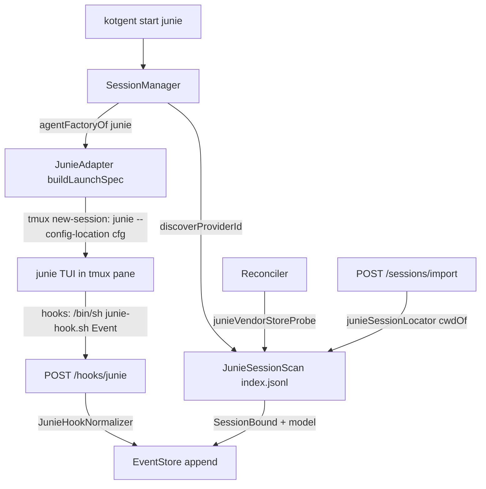

# Requirements

### Overview & Goals
Add **Junie CLI** as kotgent's third managed agent provider, with full parity to `claude` and `codex`: launch (`kotgent start junie`), live state tracking via hooks, resume, restart-safe reconciliation, import of externally started sessions, and best-effort model capture.

Verified against the installed `junie` 26.8.3 (EAP):
- `junie --resume --session-id <id>` resumes a recorded session; `--config-location <file>` installs a per-launch config (hooks ride in it, scoped to that launch — the Junie analogue of `claude --settings`).
- Sessions live at `~/.junie/sessions/` (`$JUNIE_HOME` override): `index.jsonl` has one record per session (`{sessionId, createdAt, updatedAt, projectDir, taskName}`); each session has a `<id>/events.jsonl`.
- Junie hooks (EAP): `SessionStart`, `UserPromptSubmit`, `PreToolUse`, `Stop`, `StopFailure`, `PermissionRequest`, `SessionEnd` — payload on stdin, Claude-Code-shaped `{"hooks": {...}}` config.
- Junie session ids are **not UUIDs** (`session-260730-015553-1j1h`) — the core `ProviderSessionId` UUID invariant must be relaxed.

### Scope
**In scope**
- `kotgent start junie [cwd]` launches Junie's TUI in tmux with kotgent hooks installed for that launch only.
- Hook-driven state: `running` / `ready` / `needs_approval` (observe + fall-through — Junie's own dialog is preserved), `Exited` on session end.
- `resume` of a dead-but-recorded session; Reconciler classifies dead junie sessions `resumable` iff the session survives on disk.
- `kotgent import junie <id>` with cwd discovery from `index.jsonl` (full import parity, per decision).
- Best-effort model capture from the session's `events.jsonl` (dominant-model heuristic, per decision).
- Web UI: enable the existing Junie card in the New-session dialog; update import hints and CLI help text.
- Core: relax `ProviderSessionId` to a safe-charset invariant while preserving UUID validation at the claude/codex boundaries.

**Out of scope**
- Answering approvals from kotgent (operator answers in the terminal — same as claude/codex).
- Tracking Junie's in-TUI session switching (`/new`, `/history`) behind one kotgent row (recorded limitation).
- Junie ACP/gateway/remote modes; `needs_answer` modeling; payload-carrying push.

### User Stories
- As an operator, I run `kotgent start junie ~/proj` (or use the Web UI card) and see the session appear with live state, terminal attach, and push notification when Junie waits for my approval.
- As an operator, I resume a dead junie session from the Web UI or `kotgent resume <id>` and land back in the same conversation.
- As an operator, I bring a junie session I started by hand under kotgent with `kotgent import junie session-…` without retyping its project directory.

### Functional Requirements
- Launch argv (new): `junie --config-location <kotgent-config.json>`; resume: `junie --resume --session-id <id> --config-location <…>`; no preallocated id (captured post-launch, like codex).
- The kotgent hook must **never** alter Junie's behavior: no stdout (Junie parses hook stdout as decisions), exit 0 for every event except `PermissionRequest`, which exits 1 so Junie still shows its own dialog (exit 0 would AUTO-APPROVE, exit 2 would deny).
- The hook token never appears on a command line (0600 header file + `curl -H @file`, same as claude/codex).
- An import that succeeds stays `resumable` across daemon restarts (probe/locator parity with the Reconciler).

### Non-Functional Requirements
- `./kotlin build` and `./kotlin test` stay green; changed JS passes `node --check`.
- No writes into the user's `~/.junie` (probes are readable-only); kotgent artifacts live under `~/.kotgent`, 0600.
- Degrades gracefully on a stable (non-EAP) junie that ignores hooks: the session still launches and attaches; state simply stays coarse.

# Technical Design

### Current Implementation
Adding a provider is an established seam (see `CLAUDE.md` "Two providers, one shape"): an adapter (`src/adapter/<kind>/`), a hook ingress route (`src/transport/HookRoutes.kt` → generic `hookRoutes(...)` pipeline, mounted in `Server.kt`), a `VendorStoreProbe` (`productionVendorStoreProbe`, `src/daemon/Reconciler.kt`), a `VendorSessionLocator` (`productionSessionLocator`, `src/daemon/VendorSessionLocator.kt`), and an entry in the `agentBuilders` map feeding `agentFactoryOf` (`src/cli/Commands.kt`, `Commands.daemon`). Codex is the closest template: no id preallocation, filesystem id discovery (`CodexRolloutScan`), background model capture with the conditional-write race guard.

### Key Decisions
1. **Hook delivery = per-launch config file.** `junie --config-location <~/.kotgent/junie-hooks.json>` scopes kotgent's hooks to that one launch (docs: explicit `--config-location` hooks are honored even for untrusted projects). Never write into `~/.junie/config.json` — that would fire for every junie session the user runs (same rule as codex's `$CODEX_HOME`).
2. **Approvals: observe + fall-through** (user decision). The `PermissionRequest` hook POSTs to the ingress then **exits 1** — the documented path that keeps Junie's own dialog (cost: a small TUI warning per request). During implementation, first verify whether `{"decision":"ask"}` on stdout with exit 0 passes through quietly; adopt it only if empirically proven. Exit 0 (auto-approve) and exit 2 (auto-deny) are forbidden.
3. **Id discovery from `index.jsonl`, not hooks.** Junie's documented `SessionStart` payload carries no `session_id`, so a fresh launch's id is discovered by `JunieSessionScan` (newest index record with `projectDir == cwd && createdAt >= launch time − slack` whose session dir still exists) via the existing `discoverProviderId` seam. The normalizer still maps a `SessionStart` that *does* carry a usable `session_id` to `SessionBound` (future-proof; the hook wins over the scan), and `junieHookRoutes` wires `onProviderIdRebound` exactly like codex.
4. **Relax `ProviderSessionId` (core).** New invariant in `src/core/Ids.kt`: non-blank, ≤128 chars, charset `[A-Za-z0-9._-]` (safe in paths/argv/URLs; accepts UUIDs and `session-…`). Add an `isCanonicalUuid(String)` helper; preserve the UUID guard where it is load-bearing: `ClaudeHookNormalizer.sessionBound`, `CodexHookNormalizer.sessionBound`, `CodexRolloutScan.rolloutFileSessionId`, and `SessionManager.importSession`'s lowercase normalization (lowercase only when the id is UUID-shaped — blanket lowercasing is UUID case-insensitivity, wrong for other kinds).
5. **Model capture = dominant-model heuristic** (user decision). Junie's `events.jsonl` mixes the primary model with helper models inside `modelUsage` records. `extractDominantModel(text)` (new pure sibling of `extractModel` in `src/adapter/ModelScan.kt`) picks the **most frequent** `"model":"…"` value in a bounded head (256 KB), ties → first seen. Persisted via the same id-keyed, atomically conditional `EventStore.setModelForProvider` write and the same background poll pattern (`captureJunieModelOnce` mirrors `captureCodexModelOnce`: id re-read from the row per attempt, nothing persisted while the id is unknown).
6. **`StopFailure` → `TurnCompleted`.** A turn that dies in an LLM error leaves the TUI idle; without this mapping the session would show `running` forever. `Stop` maps to `TurnCompleted` too — both are running-exits, and the reducer's approval-clearing rule is unchanged.

### Proposed Changes
**New files**
- `src/adapter/junie/JunieCli.kt` — `locate()` (`command -v junie`), `detectVersion()` (`junie --version` → `Junie version: 26.8.3 (2548.3) eap`; the existing SEMVER-triple parse pattern). No feature gate.
- `src/adapter/junie/JunieHookConfig.kt` — pure generation of (a) `hookScript(port, headerFilePath)`: `/bin/sh` script invoked as `<script> <EventName>`, `curl -sS -o /dev/null … --data-binary @-` with `$TMUX_PANE` + event headers, token via `-H @<0600 header file>`; **no stdout ever**; exit contract: `PermissionRequest` → `exit 1`, all other events → `exit 0` unconditionally (`|| :` — a curl failure must never block a `Stop`/`UserPromptSubmit`); (b) `configJson(scriptPath)`: `{"hooks": {Event: [{"hooks": [{"type":"command","command":"/bin/sh '<script>' Event"}]}]}}` via the kotlinx JSON DSL (like `ClaudeHookConfig.generate`); events: `UserPromptSubmit, PreToolUse, PermissionRequest, Stop, StopFailure, SessionStart, SessionEnd`, no matchers. `INGRESS_PATH = "/hooks/junie"`, header constants mirror the codex ones.
- `src/adapter/junie/JunieAdapter.kt` — `buildLaunchSpec`: New → `[junie, --config-location, <cfg>]`; Resume → `[junie, --resume, --session-id, <id>, --config-location, <cfg>]`; `preallocatedSessionId = null` always; `events` injected (`emptyFlow()` in production, like both peers).
- `src/adapter/junie/JunieHookNormalizer.kt` — `UserPromptSubmit`→`TurnStarted`; `PreToolUse`→`ToolCall(tool_name ?: "unknown")`; `PermissionRequest`→`ApprovalRequested(tool_name ?: reason ?: "permission@<pane>")`; `Stop`/`StopFailure`→`TurnCompleted`; `SessionStart`→`SessionBound` iff a usable `session_id` is present else `null`; `SessionEnd`→`Exited(0)`; unknown → `null`.
- `src/daemon/JunieSessionScan.kt` — `defaultJunieDir()` (`$JUNIE_HOME` else `~/.junie`); pure per-line index-record field extraction (tolerant of a truncated tail line, in the `rolloutCwd` style); `hasSession(id)` = `access(<dir>/sessions/<id>/events.jsonl, F_OK)` (disk is the authority — a pruned session in a stale index does not count); `discoverSessionId(cwd, notBeforeMillis)`; `cwdOf(id)` (index record's `projectDir`, only while the session dir exists); `modelOf(id)` (256 KB head of `events.jsonl` → `extractDominantModel`); plus `junieVendorStoreProbe(...)`, `junieSessionLocator(...)`, and `captureJunieModelOnce(store, scan, meta)`.

**Modified files**
- `src/core/Ids.kt` — relaxed `ProviderSessionId` invariant + `isCanonicalUuid` helper (Key Decision 4).
- `src/adapter/claude/ClaudeHookNormalizer.kt`, `src/adapter/codex/CodexHookNormalizer.kt`, `src/daemon/CodexRolloutScan.kt`, `src/daemon/SessionManager.kt` — explicit UUID guards / conditional lowercasing; add `JUNIE_AGENT_KIND = "junie"` next to the existing kind constants.
- `src/adapter/ModelScan.kt` — add `extractDominantModel`.
- `src/transport/HookRoutes.kt` — `Route.junieHookRoutes(...)` over the generic `hookRoutes` (path/headers/normalizer from `JunieHookConfig`/`JunieHookNormalizer`, `onProviderIdRebound` surfaced like codex).
- `src/transport/Server.kt` — mount `junieHookRoutes(tokens::current, sessionManager.paneLookup, store, HOOK_JSON, onProviderIdRebound = sessionManager::onProviderIdRebound)`.
- `src/daemon/Reconciler.kt` — `productionVendorStoreProbe(claudeDir, codexDir, junieDir)` gains the junie entry.
- `src/daemon/VendorSessionLocator.kt` — `productionSessionLocator(...)` gains the junie entry.
- `src/cli/Commands.kt` — `JunieCli` detect/locate; `writeJunieHookConfig(port, token)` (header file `junie-hook-header`, script `junie-hook.sh`, config `junie-hooks.json`, all `writePrivateFile` 0600); `agentBuilders` junie entry with `requireAbsoluteBinary`; `discoverProviderId` junie branch; `captureModelInBackground` junie branch (same attempts/interval constants).
- `src/cli/Cli.kt` — USAGE: `agent: 'claude' | 'codex' | 'junie'`.
- `resources/webui/lib/agents.js` — flip the existing Junie card to `available: true`.
- `resources/webui/components/dialogs.js` — `CLI_HELP` text; import-id field hint gains junie (`the directory name under ~/.junie/sessions, e.g. session-…`).
- `CLAUDE.md` / `README.md` — "Two providers, one shape" → three; provider-differences notes (hook delivery via `--config-location`, no PermissionRequest auto-answer, id from `index.jsonl`).

### Architecture Diagram

### Risks
- **Junie hooks are EAP/nightly.** A stable junie may ignore the `hooks` config: the session launches and attaches fine but state stays coarse (`running` until reconciled). Documented, no hard gate — `cliVersion` metadata is the support handle.
- **PermissionRequest fall-through warning.** Exit 1 produces a small warning notification in Junie's TUI per permission dialog. Verify the quieter `decision:"ask"` variant empirically before adopting; never regress to exit 0/2.
- **Hook stdout is parsed by Junie** (invalid JSON becomes `additionalContext`). The script's only output channel is stderr; pin with a generation test asserting the curl carries `-o /dev/null` and the script never `echo`es.
- **Same-cwd neighbour discovery bind** — same class as codex: mitigated by the `notBefore` threshold, the rebind seam, and the conditional model write.
- **In-TUI session switching** (`/new`, `/history`) changes the live junie session behind one kotgent row; resume then targets the originally bound id. Recorded limitation (heals only if Junie ever puts `session_id` in hook payloads).
- **Junie prunes old session context** (~last 10 sessions): a pruned session honestly classifies `crashed`, not `resumable` — the disk probe, not the index, answers.
- **Trust prompt** on first launch in an unknown project appears inside the TUI; the operator answers there. `--config-location` hooks fire regardless of the trust decision (documented Junie behavior).

# Testing

### Validation Approach
Everything testable without a live agent runs in the native suite (`./kotlin build` **then** `./kotlin test` — PtyTest execs the ptycheck binary). No test launches a real `junie`, writes into `~/.junie`, or starts the daemon (automation rules). Filesystem-scan tests run over throwaway fixture homes, exactly like `CodexRolloutScanTest` / `ImportWiringTest`.

### Key Scenarios
- **Adapter argv** (`test/adapter/junie/JunieAdapterTest.kt`): New → `junie --config-location <cfg>`; Resume → `junie --resume --session-id <id> --config-location <cfg>`; never preallocates; cliVersion/cliPath echoed.
- **Hook config generation** (`test/adapter/junie/JunieHookConfigTest.kt`): config JSON wires all seven events to `/bin/sh '<script>' <Event>`; script POSTs to `/hooks/junie?event=`, reads the token via `-H @<file>` (token never inline), carries `$TMUX_PANE`; **exit contract pinned**: `PermissionRequest` path exits 1, every other event exits 0 even when curl fails; no stdout-producing command in the script.
- **Normalizer** (`test/adapter/junie/JunieHookNormalizerTest.kt`): the full event mapping incl. `StopFailure`→`TurnCompleted`, `SessionStart` with/without `session_id`, malformed payload tolerance.
- **CLI version parse** (`test/adapter/junie/JunieCliTest.kt`): `"Junie version: 26.8.3 (2548.3) eap"` → `26.8.3`; absent binary → null.
- **Session scan** (`test/daemon/JunieSessionScanTest.kt`): index-record parsing (incl. truncated tail line), `hasSession` disk-vs-stale-index, `discoverSessionId` cwd + notBefore threshold + slack + newest-wins, `cwdOf`, `modelOf` over a fixture `events.jsonl` with mixed `modelUsage` models (dominant wins).
- **Model extraction** (`test/adapter/ModelScanTest.kt`): `extractDominantModel` — frequency winner, tie → first seen, none → null.
- **Ingress** (extend the hook-route transport tests): `/hooks/junie` auth → pane → normalize → append; rebind seam fires on displacement.
- **Import wiring** (`test/daemon/ImportWiringTest.kt`): production probe + locator dispatch over a throwaway junie home — import junie by id discovers `projectDir` and stays `resumable` through a reconcile.
- **Core ids**: relaxed `ProviderSessionId` accepts `session-260730-015553-1j1h`, still rejects blank/unsafe chars; `isCanonicalUuid` truth table; claude/codex normalizers still drop non-UUID ids; import lowercases UUIDs only.

### Edge Cases
- Curl failure during a `Stop` hook must not block Junie's submission (exit-0 branch pinned).
- `discoverSessionId` ignores a same-cwd session created before launch (threshold) and an index record whose session dir was pruned.
- Model capture persists nothing while the provider id is unknown; a raced rebind write hits zero rows (conditional-write reuse).
- `rolloutFileSessionId` still refuses a 36-char non-UUID tail after the core relaxation (regression guard).

### Test Changes
- New: `test/adapter/junie/*` (4 files), `test/daemon/JunieSessionScanTest.kt`.
- Extended: `ImportWiringTest`, hook-route transport tests, `ModelScanTest`, core `Ids` tests, `CliTest` (usage text), normalizer UUID-guard tests.
- `node --check` on the two edited JS modules; `WebUiServingTest` unchanged (no new served files).
- Manual checklist (recorded in the PR/docs, not automated): launch → trust prompt → state transitions, approval dialog preserved + `needs_approval` shown, resume, import, `decision:"ask"` experiment.

# Delivery Steps

### ✓ Step 1: Relax ProviderSessionId and build the Junie adapter (outgoing half)
Kotgent core accepts Junie's non-UUID session ids, and a pure JunieAdapter renders correct launch/resume argvs with hook config generation.

- Relax `ProviderSessionId` in `src/core/Ids.kt` to the safe-charset invariant (non-blank, ≤128, `[A-Za-z0-9._-]`) and add `isCanonicalUuid`.
- Preserve UUID guards at the boundaries: `ClaudeHookNormalizer.sessionBound`, `CodexHookNormalizer.sessionBound`, `CodexRolloutScan.rolloutFileSessionId`, and make `SessionManager.importSession`'s lowercase normalization conditional on UUID shape.
- Add `JUNIE_AGENT_KIND = "junie"` in `src/daemon/SessionManager.kt`.
- Add `src/adapter/junie/JunieCli.kt` (locate + `--version` parse of `Junie version: 26.8.3 (2548.3) eap`).
- Add `src/adapter/junie/JunieHookConfig.kt`: `/hooks/junie` constants, the hooks config JSON for `--config-location`, and the `junie-hook.sh` generator with the pinned exit contract (`PermissionRequest` → exit 1 to preserve Junie's dialog; all other events → exit 0 even on curl failure; zero stdout).
- Add `src/adapter/junie/JunieAdapter.kt`: New → `junie --config-location <cfg>`, Resume → `junie --resume --session-id <id> --config-location <cfg>`, no preallocated id.
- Tests: core id relaxation + UUID-guard regressions, `JunieCliTest`, `JunieHookConfigTest` (exit contract, token-off-argv, no stdout), `JunieAdapterTest`.

### ✓ Step 2: Add the /hooks/junie ingress (incoming half)
Junie hook callbacks are authenticated, normalized to AgentEvents, and appended to the EventStore.

- Add `src/adapter/junie/JunieHookNormalizer.kt` with the mapping: `UserPromptSubmit`→`TurnStarted`, `PreToolUse`→`ToolCall(tool_name)`, `PermissionRequest`→`ApprovalRequested`, `Stop` and `StopFailure`→`TurnCompleted`, `SessionStart`→`SessionBound` iff the payload carries a usable `session_id` (else null), `SessionEnd`→`Exited(0)`.
- Add `Route.junieHookRoutes(...)` in `src/transport/HookRoutes.kt` over the generic `hookRoutes` pipeline, surfacing `onProviderIdRebound` like the codex route.
- Mount it in `src/transport/Server.kt` with `onProviderIdRebound = sessionManager::onProviderIdRebound`.
- Tests: `JunieHookNormalizerTest` (full mapping, malformed payloads), transport hook-route tests for `/hooks/junie` (auth, pane resolution, append, rebind seam).

### ✓ Step 3: Implement JunieSessionScan: probe, locator, id discovery, model capture
Dead junie sessions classify as resumable, import discovers the project dir, fresh launches bind their id from index.jsonl, and the dominant model is captured.

- Add `src/daemon/JunieSessionScan.kt`: `defaultJunieDir()` (`$JUNIE_HOME` else `~/.junie`), pure index.jsonl record parsing, `hasSession(id)` (disk existence of `sessions/<id>/events.jsonl`), `discoverSessionId(cwd, notBeforeMillis)` with the slack threshold, `cwdOf(id)`, `modelOf(id)` over a 256 KB head.
- Add `extractDominantModel` to `src/adapter/ModelScan.kt` (most frequent `"model":"…"`, tie → first seen).
- Add `junieVendorStoreProbe` / `junieSessionLocator` and register them in `productionVendorStoreProbe` (`src/daemon/Reconciler.kt`) and `productionSessionLocator` (`src/daemon/VendorSessionLocator.kt`).
- Add `captureJunieModelOnce` mirroring `captureCodexModelOnce` (row id re-read per attempt, conditional `setModelForProvider` write, nothing persisted while the id is unknown).
- Tests: `JunieSessionScanTest` over a throwaway fixture home (discovery threshold, stale-index vs disk, dominant model), `ModelScanTest` additions, `ImportWiringTest` extension proving import junie stays `resumable` through a reconcile.

### ✓ Step 4: Wire the daemon bootstrap and CLI
`kotgent start junie` / `resume` / `import junie` work end-to-end through the daemon.

- In `Commands.daemon` (`src/cli/Commands.kt`): detect `JunieCli` version/path, add `writeJunieHookConfig(port, token)` writing the 0600 `junie-hook-header`, `junie-hook.sh`, and `junie-hooks.json`, add the `agentBuilders` junie entry with `requireAbsoluteBinary`, extend `discoverProviderId` with the `JunieSessionScan` branch, and extend `captureModelInBackground` with the junie poll (same attempts/interval constants).
- Update `src/cli/Cli.kt` USAGE to `'claude' | 'codex' | 'junie'`.
- Tests: `CliTest` usage/help expectations; verify the builders-map keys drive both the factory and `supportedAgentKinds` (import gate) for junie.

### ✓ Step 5: Enable the Web UI card, update docs, and run full validation
The Web UI offers Junie as a startable agent, docs reflect three providers, and the whole suite is green.

- Flip the Junie card to `available: true` in `resources/webui/lib/agents.js`.
- Update `resources/webui/components/dialogs.js`: `CLI_HELP` text and the import-id field hint (junie: the directory name under `~/.junie/sessions`, e.g. `session-…`).
- Run `node --check` on both edited JS modules; confirm `WebUiServingTest` needs no registration change (edits only, no new files).
- Update `CLAUDE.md` ("Two providers, one shape" → three, junie's provider-differences: `--config-location` hook delivery, PermissionRequest observe+fall-through, id from `index.jsonl`, EAP-hooks dependency) and `README.md`.
- Record the manual verification checklist (live launch, trust prompt, approval dialog preserved with `needs_approval` shown, resume, import, the `decision:"ask"` experiment) in the plan/PR notes.
- Run `./kotlin build` then `./kotlin test`; keep the suite at zero skips.